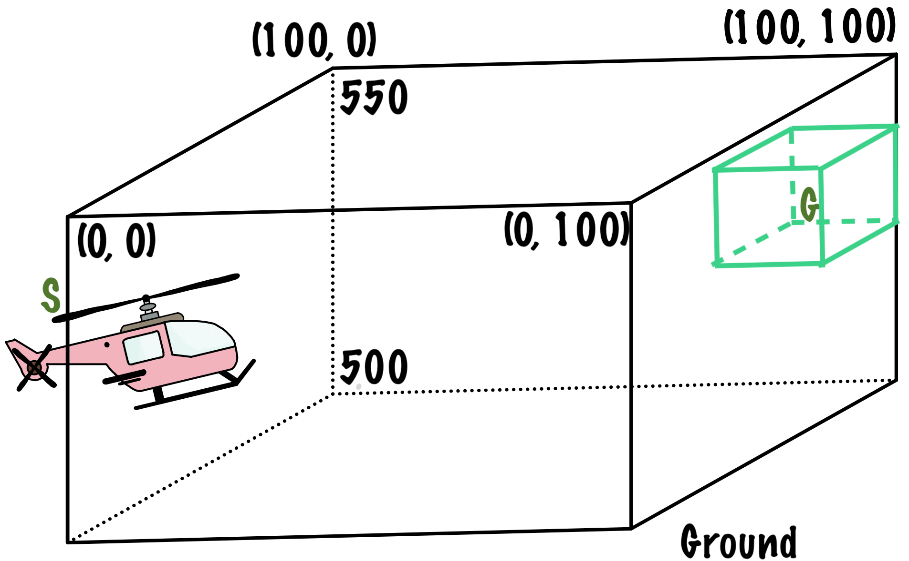

The aim of this is to deinf a custom environment. Here, we will define a custom environment of a helicopter flying in a fixed space. A simple visual representation of this can be seen in the given image.

## Environment Definition

Consider a hypothetical situation where we have a remote-controlled helicopter and we want it to automatically fly in the space we define. For this, we intend to use reinforcement learning to help the helicopter fly by itself rather than having us control it. The space where we want the helicopter to fly can be visualized as a cuboid. We start from the point (0,0) at a height of 525 ft (depicted by S in the image) above the ground. We want the helicopter to fly by itself close to the point (100,100) at a height anywhere between 520 ft and 540 ft above the ground (depicted by G in the image). To reach our goal from the start point, we have to decide the amount of acceleration at each step (i.e. each second). Remember we start with 0 ft/s velocity

However, since this space is outdoor there is an additional variable to take into account, wind. We would like to define 4 directions of the wind in the horizontal direction i.e. "North", "South", "East" and "West". In the vertical direction, the wind direction can be "Up", "Down" and "None" (which indicates there is no wind).

#### STATE SPACE 

The state-space of the environment consists of all possible positions within the cuboid, which is a tuple of (x,y,h). Each value in the tuple is a floating-point indicating the specific position of the helicopter along a particular axis.

#### ACTION SPACE 

The amount of acceleration to give at each step of our way.

#### REWARD RULES 

The green cuboid within our space is our target. The x-axis range is from 90 to 100 ft and the y-axis range is from 90 to 100 ft. The height range is from 520 to 540 ft from the ground.

- When the helicopter enters this cuboid, the goal is reached and a reward of 100 is given.
- If the helicopter goes beyond 110ft along the x-axis or y-axis or goes above 570ft or below 490 ft from the ground, penalize it by 10 points and end the episode.
- If the helicopter goes out of the possible range along the x-axis, y-axis and height as mentioned above, penalize it by 10 points.
- If the helicopter does not move forward i.e the previous position of the helicopter is closer to the goal than the current position, penalize it by 2 points.
- For every other step that does not come under any of the categories mentioned above, give a reward of plus 1.

#### STATE COMPUTATION

The state of the environment consists of 3 values, the x-position, the y-position and the height (distance from the ground). The initial values are 0, 0 and 525 respectively. For the given action, which is the acceleration, we need to compute the new position of the helicopter. To compute this, we first need to get the wind speed at that moment, which is a random variable ranging from 0.1 to 5 ft/s. Then randomly sample the wind direction along the horizontal and vertical directions. 

- Compute the velocity $v$ using the formula, 

a\ =\ \frac{\left(v-u\right)}{\Delta t}

where $a$ is the acceleration, $u$ is the initial velocity and $\Delta t$ is rate of change of time which is 1 sec for each time step. 

- Compute the distance travelled using the formula,

d\ =\ v\ t

where $d$ is the distance, $v$ is the computed velocity and $t$ is the time span of each step.

- Compute the wind speed as 0.7 times the one obtained. As the weight of the helicopter resists the force of the wind to a certain extent.

- Compute another distance with $v$ as the updated wind speed.

- For each position update, the new position is the sum of the previous position along that axis and the distance due to the action taken. Update the positions, only along the x and y-axis, not the height.

- Additionally, due to the wind speed, the actual position of the helicopter changes from the updated one.

  - For the horizontal directions,

    - If the direction is East, then the helicopter is pushed further along the x-axis. The y-position remains the same.

    - If the direction is West, then the helicopter movement is resisted further along the x-axis. The y-position remains the same.

    - If the direction is North, then the helicopter is pushed further along the y-axis. The x-position remains the same.

    - If the direction is South, then the helicopter movement is resisted further along the y-axis. The x-position remains the same.

      

  - For the vertical directions,

    - If the direction is Up, the height will be increased by the displacement caused by the wind.
    - If the direction is Down, the height will be decreased by the displacement caused by the wind.
    - If the direction is None, the height will remain the same.

## Instructions:

- Load the necessary libraries.
- Define 2 lists, one for all the possible wind direction along the horizontal direction and one for the vertical one.
- Create a class HelicopterSpace that inherits from OpenAI Gym's Env. This class will be your environment.
- Within the class,
  - Define the constructor __init__, initialize the observation_space and action_space according to the above description. Set the initial values of the state, reward and other variables you think are necessary.
  - Define a function variable_envo  that samples from the 2 wind direction lists and gives a random wind speed within the mentioned range, when called.
  - Define a function compute_position that computes the new position of the helicopter given the previous position, the wind speed, directions and acceleration (action).
  - Define a method step that takes an action as input and returns the reward based on the instructions above. Within this function, call the variable_envo function to get the wind direction and speed and then call the compute_position function to update the helicopter position.
  - Define a method reset, that reset the class variables to their initial value.

- Select the number of episodes.
- Set the maximum number of seconds in an episode i.e. the maximum number of steps in the episode.
- Create an instance of the environment.
- For each episode, while the number of steps has not reached the threshold,
  - Sample an action from the set of possible action and get call the step method.
  - At the end of each episode, print the total rewards of that episode.

