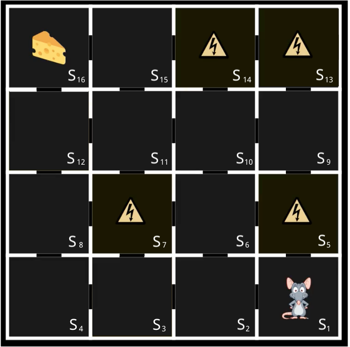

The aim of this exercise is to learn how to set up a custom environment using OpenAI Gym. OpenAI Gym is a toolkit for developing and comparing reinforcement learning algorithms. It supports teaching agents everything from walking to playing games like Pinball.

The environment will consist of a state, reward and action. For our custom environment, we would like to implement the mouse grid we saw in the lectures. The possible rewards and state given the current state are in the helper file. 

The overall reward pattern is as follows, every next state gets a plus one reward, a terminal state leads to -10 and the mouse has to start from state 1 again. Every action leading to a previous state is penalized by 1 and reaching the goal i.e. state 16 gets a +100 reward.

## **Instructions**

- Create a class MouseGrid that inherits from OpenAI Gym's Env. This class will be your environment.

- Within the class constructor __init__, initialize the observation_space and action_space. 
  - The observation space is the set of all possible state values, which are 16 in our case.
  - The action space is the set of all possible actions one can take in an environment. 1 indicates up, 1 indicates left, 3 indicates right and 4 indicates down.

- Set the initial state to be 1 and the reward to be zero.
- Define a method step that take the action and returns the reward based on the instructions given in the helper file.
- Define a method reset, that reset the class variables to their initial value.
- Select the number of episodes.
- Create an instance of the MouseGrid environment.
- Loop over the total number of episodes.
  - Sample an action from the set of possible action and get call the step method.
  - At the end of each episode, print the total reward of that episode.

NOTE - Remember that the reward can be negative as well. It depends on how the reward system is defined within the environment. 

In this exercise, we are using a random policy, by randomly sampling from the set of possible actions defined within the environment.

## **Hints**

Discrete()

The Discrete space allows a fixed range of non-negative numbers

Env.action_space.sample()

To select a value randomly from the action space defined in the environment.