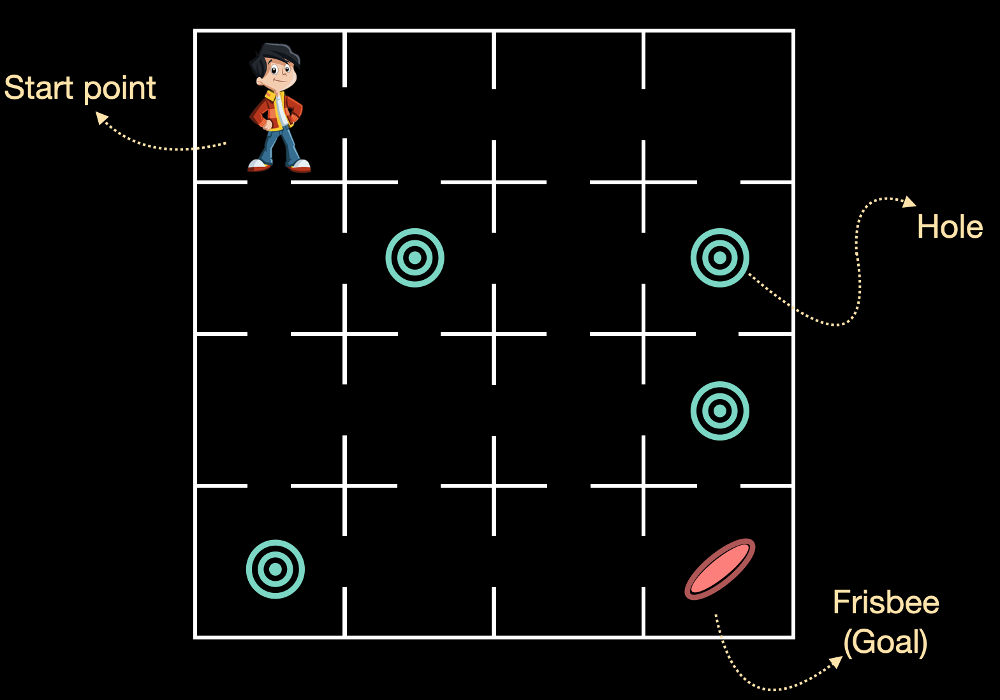

The aim of this lab is to find the optimal policy that gives the optimal path to reach the frisbee given an environment. For this, we will be using a pre-defined environment by OpenAI Gym. We will be using an environment called FrozenLake-v0.

This is similar to the exercise, where we used value iteration. In this lab, we will learn how to implement policy iteration.

## Environment Description:

Winter is here. You and your friends were tossing around a frisbee at the park when you made a wild throw that left the frisbee out in the middle of the lake. The water is mostly frozen, but there are a few holes where the ice has melted. If you step into one of those holes, you'll fall into the freezing water. At this time, there's an international frisbee shortage, so it's absolutely imperative that you navigate across the lake and retrieve the disc.

The agent controls the movement of a character in a grid world. Some tiles of the grid are walkable, and others lead to the agent falling into the water. Additionally, the movement direction of the agent is uncertain and only partially depends on the chosen direction. The agent is rewarded for finding a walkable path to a goal tile.

The surface is described using a grid-like the following:

Possible actions are Left(0), Right(1), Down(2), Up(3).

NOTE - Here we are slightly altering the value iteration algorithm. Instead of computing the optimal value function first, we compute the optimal policy and then find the value function associated with it.

policy_iteration_algo

## **Instructions**

- Initialize an environment using a pre-defined environment FrozenLake-v0 from OpenAI Gym. Take a quick look at the environment by calling the render method.
- Define a function policy_evaluation that takes a policy and the discount factor as the parameter and returns the updated value function table based on the policy.
- Define a function policy_improvement that takes as input the updated value function table and the discount factor as the parameter and returns an improved policy.
- Define a function policy_iteration that takes the environment and the discount factor as the parameter. This function iteratively calls the policy_evaluation and policy_improvement functions to return the optimal policy.
- Finally, call the policy_iteration with the environment and the discount factor to get the optimal policy.

## **Hints**

Equation to compute the value function of a state:

v(s) \gets  \sum_{\{s',r\}} p(\{s',r\}|s,\pi(s)) [r + \gamma v(s')]

Equation to compute the policy given the value function table:

\pi(s) \leftarrow \underset{a}{\mathrm{argmax}} \sum_{\{s', r\}}p(\{s',r\}|s,a)[r+\gamma v(s')]

$p({s',r}|s,a)$ is given by OpenAi Gym using env.P . This is similar to what was done in the session exercise.