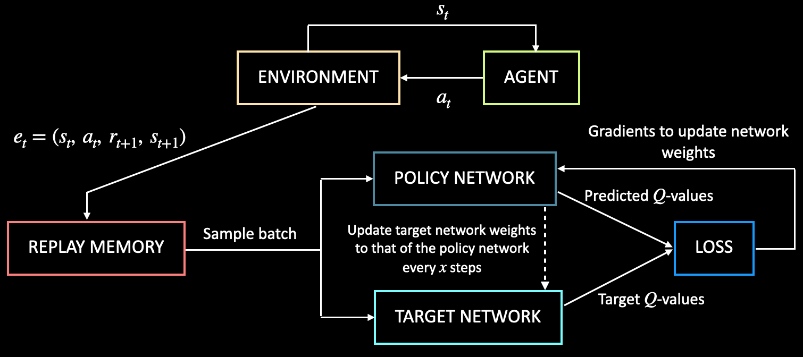

The aim of this lab exercise is to implement Double Deep-Q Networks from scratch. For this, we will make use of the pre-defined FrozenLake-v0 environment by OpenAI Gym. Feel free to reuse any code from the previous exercise in this lab you deem fit.

## **Instructions**

- Initialize an environment using a pre-defined environment FrozenLake-v0 from OpenAI Gym. Get the number of actions.
- Define a function get_model that will return the neural network that takes as input the state of the environment and outputs the Q-values associated with all possible actions in the environment.
- Define a class ReplayMemory that stores the experiences of the agent in the environment.
- Define a function epsilon_greedy that performs the epsilon greedy policy to select the action given the state.
- Set the values of all the algorithm parameters.
- Create an instance of the ReplayMemory class.
- Create 2 neural networks, the policy network and the target networks. Set the weights of them to be equal.
- Define the loss function and optimizer of the model.

**TRAINING THE MODEL**

- For each episode:
  - Initialize the starting state of the environment.
  - For each step in the episode:
    - Select an action using the epsilon greedy policy.
    - Execute selected action in the environment to get the next state and reward.
    - Store the experience in replay memory.
    - After the warm-up period ends:
      - Sample random batch from replay memory.
      - Get the predicted Q-values for the current state by passing it to the policy network.
      - Get the target Q-values from the target network.
      - Calculate loss between predicted Q-values and target Q-values.
      - Using gradient tape, update the weights of the policy network
      - After a defined number of updates to the policy network, update the weights of the target network to that of the policy network.

**TEST THE AGENT IN THE ENVIRONMENT**

- Initialize the state of the environment
- Loop till the end of the episode:
  - Given the state, get the best action from the policy network. For this, take the action that gives the maximum q-value.
  - Execute selected action in the environment to get the next state and reward.
  - Update the current state of the environment.

- Print whether or not the agent reached the goal and in how many steps.

## **Hints**

Equation to compute the target Q-values:

Q' = q'(s,a)\cdot\gamma + r

Equation to compute epsilon based on epsilon decay rate algorithm:

\epsilon=\epsilon_{\min}+\ (\epsilon_{\max}-\epsilon_{\min})\cdot(e^{-\gamma\cdot\eta}))

where $\eta$ is the episode number 