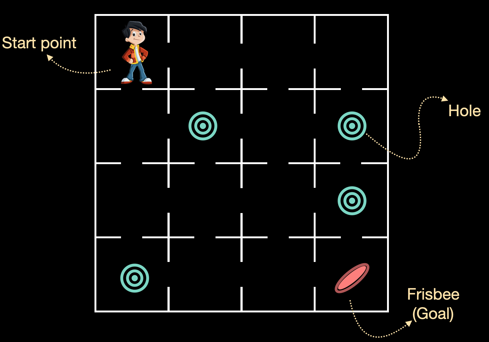

The aim of this exercise is to implement Deep Q Networks for a pre-defined reinforcement learning environment. For this, we will be using a pre-defined environment by OpenAI Gym. We will be using an environment called FrozenLake-v0. This is the same as what was used for the previous session (Refer to it to get information about the environment).

## **Instructions**

- Initialize an environment using a pre-defined environment from OpenAI Gym.
- Get the number of possible actions in the environment. 
- Define a simple feed-forward neural network with your choice of hidden layers and nodes.
- Define the action sampling policy. We will be using the Epsilon Greedy policy.
- Initialize sequential memory to store the data, which is the input to the DQN.
- Define the DQN and compile it with Adam optimizer.
- Fit and test the DQN model.

## **Hints**

gym.make(environment-name)

Access a pre-defined environment

Env.action_space.n

Returns the number of discrete actions

Env.observation_space.n

Returns the number of discrete states

 Dense()

A regular densely-connected NN layer

Flatten()

Flattens the input. 

Adam()

Optimizer that implements the Adam algorithm

DQNAgent()

Initializes the DQN Agent

SequentialMemory()

Keras-RL provides a class called rl.memory.SequentialMemory that provides a fast and efficient data structure that we can store the agent’s experiences in.