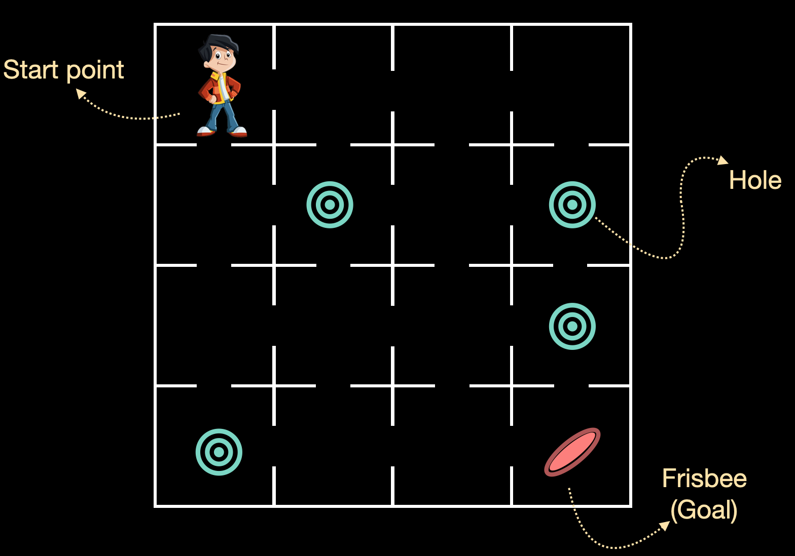

The aim of this is to understand how to implement simple Q-learning. For this, we will be using the FrozenLake-v0 environment from OpenAI Gym. First, we will compute the Q-table from an arbitrary initialization and then we will let the test the agent in the environment based on the updated Q-table.

## **Instructions**

- Initialize an environment using a pre-defined environment FrozenLake-v0 from OpenAI Gym. Get the number of actions and the number of states.
- Initialize the Q-table with dimension number of states * number of actions.
- Set the algorithm parameters.
- Define a function epsilon_greedy that performs the epsilon greedy policy to select the action given the state.
- Define the Q-learning algorithm to update the Q-table.
- Take a look at the updated Q-table.
- Let the agent free in the environment with the updated Q-table.

## **Hints**

Equation to compute the Q-value:

q\left(s,a\right)=\ q\left(s,a\right)\cdot\left(1-\alpha\right)\ +\ \alpha\left(r\ +\ \gamma\cdot\max\left(q\left(s',a\right)\right)\right)

Equation to compute epsilon based on epsilon decay rate algorithm:

\epsilon=\epsilon_{\min}+\ (\epsilon_{\max}-\epsilon_{\min})\cdot(e^{-\gamma\cdot\eta}))

where $\eta$ is the episode number 